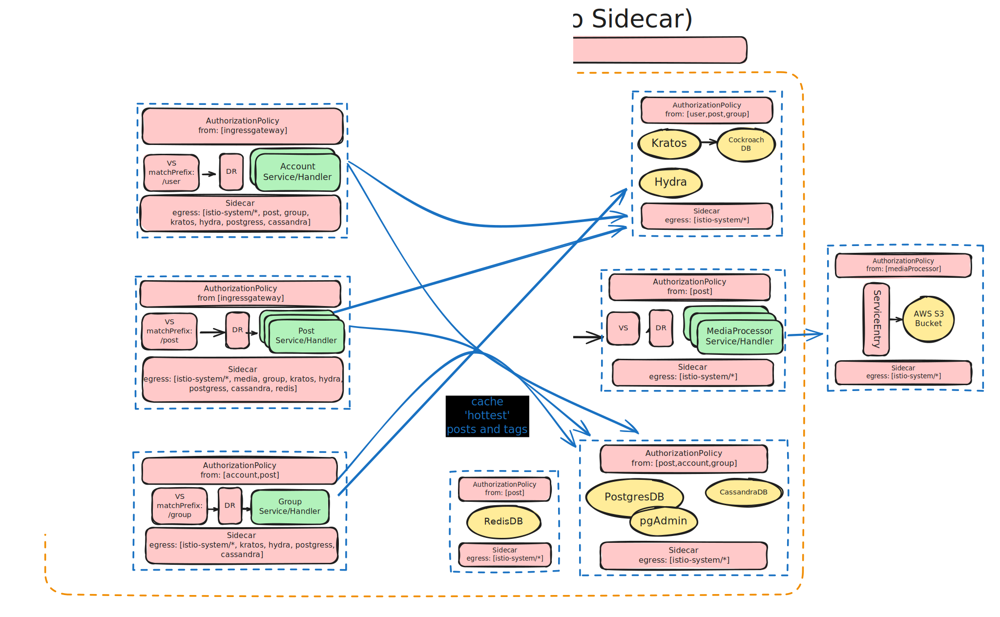

# FFFoto

100% a copy/recreation of one of my favorite mobile apps from almost 10 years ago: [PHHHOTO](https://phhhoto.com).

## System Design

### Initial Design

This was the initial "design" I came up with. Some things may be able to be consolidated to be more monolith; I wanted to keep it modular/microservices, because:
1. I'm still getting a hang of service meshes and how they work.
   - This design was a good way to then dig deeper and service mesh it up.
2. Thinking about the different potions(?) as company 'teams' I realize that they could be made into separate services to scale them independently.
   - Not sure if it's also possible to independently scale in a monolith, but I think it's easier to do - or at least think about - in a microservice architecture.

The idea here was that the different services are scaled separately. 
They can all be in the same cluster for simplicity, but things such as the "Post" handler - which would process things like comments, posts, likes - will likely need to be scaled more than the "account" service which would only handle user data and logging in.

### Follow-Up Service Mesh (Istio Sidecar Mode) Design

This is from going through an Istio course and using it a teeny bit. There may be better ways to design this, but this is what I came up with.
There are some things missing that I would need to look into to learn about more, like during the image processing loop ("live editing") how this would be handled: direct requests/responses vs. queueing, etc.

So many arrows. Ideally I'd like a closed environment which is why all services are DENY'd at the base, with each service allowing only the services it needs to communicate with.
All services have their own **AuthorizationPolicy** and **Sidecar** to explicitly allow only the services they need to communicate with. 
Because the **istiod** control plane will be updating all sidecars with related endpoint data on updates, it's also important to only "connect"(?) needed services through `Sidecar` CR so not everything updates.

For simplicity everything is in a single cluster, and scaling it all would just be deploying more <?> clusters in different regions so that ingress traffic is based on locality.

I'm not sure if this is the best way to handle it, specifically the databases within the cluster, I still need to look into them and how production environments handle it, but ideally if they are deployed per cluster, then everything but the
`main` cluster should just be a read replica. It may be easier to have databases as part of a separate cluster still within the mesh so that I figure out how they scale better. 
Or better yet, use a cloud provider for these databases and let the provider scale for me ☺️ (but it'd still be good practice to learn how it's done.)

For user authN/authZ, I was initially going for Keycloak as it's what I sort of know and bootstrapped before, but saw that through Kratos & Hydra, Ory has a lot of the same features and _may_ be more suitable, it's clear there's SSO options and more, which would be neat
for a 'social media' service like this. I haven't used these so need more research, but Kratos would need to be backed with a DB to store user data (username + hashed password), so I'd need a DB for that.

There is an external S3 bucket for video storage, so we need a `ServiceEntry` to register it with the mesh.

Note: One thing that's glaring (or maybe not) is just ensuring every workload has their own `ServiceAccount` to use as the principal for the `AuthorizationPolicy` (and `Sidecar`?) CRs.

#### Database considerations

There are a few databases that would likely be in use for this.

##### PostgresDB (or CockroachDB)
PostgresDB will be used to store relational data such as user data, posts, comments, groups, etc.
Maybe could use CockroachDB since I've read it's good for scaling - which this app would be doing across multiple nodes, but I haven't used it before.

##### RedisDB
RedisDB will be used for caching things on a daily basis, such as trending posts and tags. By "such as", I mean that's all I can think of right now, and should likely be enough.

##### AWS S3
AWS S3 will be used to store video files, and the link to the video will be stored in the PostgresDB.

##### CassandraDB
\[Optional/Maybe\] 
I haven't used Cassandra before, but I believe it's powerful for write-heavy workloads. 
Still need to research, but could be useful for messaging, handling comments, handling likes, etc.
This would only be useful if I _really_ need to scale this up.

### Follow-Up Service Mesh (Istio Ambient Mode) Design

TODO: When I complete reading through the ambient mesh documentation and understand it better.

## Additional Notes

- The SVG are embedded with Excalidraw, so it should be easy to modify them if you want to make changes.
